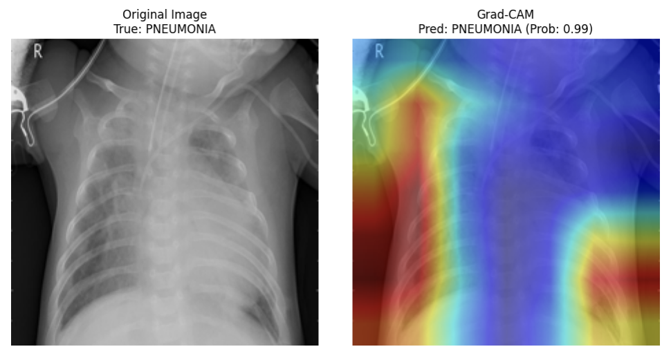

# 胸部X線画像を用いた小児肺炎の自動分類モデル

---
**【免責事項】**
本プロジェクトおよび提供されるモデル・コードは、機械学習技術の学習および研究のみを目的として作成されたものです。**実際の医療現場における診断、治療、予防、その他のいかなる医療行為への利用も意図しておらず、また推奨しません。** 実際の医療判断は、必ず専門の医師によって行われる必要があります。

---

## 1. プロジェクト概要
本プロジェクトは、約6,000枚の小児胸部X線画像を用いて、正常（NORMAL）と肺炎（PNEUMONIA）を自動的に判別するディープラーニングモデルの構築を目的としています。
単にAccuracy（正解率）を追求するのではなく、医療現場において致命的となる「肺炎患者の見逃し（偽陰性）」を防ぐため、**Recall（再現率）を最重要指標**としてモデルを評価・最適化しました。

## 2. 使用データセット
- **名称**: [Chest X-Ray Images (Pneumonia)](https://www.kaggle.com/datasets/paultimothymooney/chest-xray-pneumonia) (Kaggle)
- **対象**: 1〜5歳の小児の胸部X線画像
- **総画像数**: 5,863枚
- **クラス**: 2クラス（`NORMAL`: 正常, `PNEUMONIA`: 肺炎）

## 3. 実行環境
- **ハードウェア**: 
  - 学習・CPU推論: ローカルマシン (Jupyter Notebook)
  - GPU推論: Google Colab (NVIDIA T4 GPU)
- **言語・主要ライブラリ**:
  - Python 3.10+
  - PyTorch / torchvision
  - Scikit-learn, Pandas, NumPy
  - Matplotlib, Seaborn
  - pytorch-grad-cam

## 4. ディレクトリ構成
```text
.
├── README.md
├── notebooks/
│   └── pneumonia_classification.ipynb
├── src/
│   ├── dataset.py
│   ├── models.py
│   ├── train.py
│   └── evaluate.py
├── outputs/
│   ├── figures/
│   └── metrics/
└── requirements.txt

```

## 5. 実行手順

1. 本リポジトリをクローンします。
```bash
git clone ---
cd ---

```


2. 必要なライブラリをインストールします。
```bash
pip install -r requirements.txt

```


3. Kaggleよりデータセットをダウンロードし、`data/` ディレクトリ内に配置します。
4. `notebooks/pneumonia_classification.ipynb` をJupyter Notebookで開き、セルを上から順に実行してください。

## 6. モデル構成

本プロジェクトでは、以下のモデルを検証しました。

1. **Baseline CNN**:
本プロジェクトの比較基準（ベースライン）とするために、ゼロから独自に設計・学習させたシンプルな画像認識モデル。
2. **ResNet18 (転移学習)**:
大量の一般画像（ImageNet）で「モノの特徴を捉える視覚」をすでに獲得している強力なAIを活用。その基礎知識をそのまま活かし、最後の「分類する部分」だけを肺炎用に再学習（転移学習）させたモデル。
3. **ResNet18 (Fine-tuning)**:
上記の転移学習からさらに踏み込み、AIの深い層（後半のネットワーク）の凍結も解除した本命モデル。既存の知識を壊さないよう極めて小さな学習率（1e-4）で慎重に微調整を行い、レントゲン特有の「微細な浸潤影」を見分ける能力を特化させた。
4. **EfficientNet-B0**:
「計算量が少ないのに高精度」を実現するよう最適化されたアーキテクチャ。ResNetと同様に事前学習の知識を活かして最終層のみを再教育し、実運用における「軽さと精度のバランス」を検証するために導入。

## 7. 評価指標

クラス不均衡があるため、Accuracy単独での評価は避け、以下の指標を総合的に確認しました。

* **Accuracy**: 全体の正解率。
* **Precision**: 肺炎と予測したもののうち、本当に肺炎だった割合（誤報の少なさ）。
* **Recall　(PNEUMONIA)**: 実際の肺炎画像のうち、モデルが正しく肺炎と予測できた割合（見逃しの少なさ）。
* **F1-score**: PrecisionとRecallの調和平均。
* **推論速度 (ms/image)**: 1枚の画像を診断するのにかかる時間。

## 8. 誤分類分析

Grad-CAMでモデルが見ている領域を可視化しました。


## 9. 推論速度とモデルサイズ比較

学習済みモデルの環境別推論速度とモデルサイズの比較結果は以下のとおりです。

| Model | Accuracy | Precision | Recall | F1-score | Size (MB) | CPU Latency (ms) | GPU Latency (ms) |
| :--- | :---: | :---: | :---: | :---: | :---: | :---: | :---: |
| Baseline CNN | 0.8109 | 0.7931 | 0.9436 | 0.8618 | 49.02 | **3.78** | **0.27** |
| ResNet18 | **0.9071** | **0.9089** | **0.9462** | **0.9271** | 42.71 | 21.80 | 1.12 |
| EfficientNet-B0 | 0.8798 | 0.8851 | 0.9282 | 0.9061 | **15.58** | 51.38 | 1.36 |

## 10. 実験結果

テストデータを用いた各モデルの最終評価結果は以下のとおりです。

| Model | Accuracy | Precision | Recall | F1-score | Notes |
| :--- | :---: | :---: | :---: | :---: | :--- |
| Baseline CNN | 0.8109 | 0.7931 | 0.9436 | 0.8618 | from scratch |
| ResNet18 Frozen | **0.9071** | **0.9089** | 0.9462 | **0.9271** | transfer learning |
| ResNet18 Fine-tuned | 0.8926 | 0.8696 | **0.9744** | 0.9190 | unfreeze layer4 |
| EfficientNet-B0 | 0.8798 | 0.8851 | 0.9282 | 0.9061 | lightweight model |

## 11. 考察

* **正解率（Accuracy）と見逃しの少なさ（Recall）のトレードオフ**

  全体的な正解率およびF1-scoreが最も高かったのは、最終層のみを学習させたResNet18 Frozenでした。これはImageNetの事前学習による汎用的な特徴量抽出が極めて有効に機能したことを示しています。
  しかし、医療現場で最も回避すべき「肺炎の見逃し（偽陰性）」を防ぐ指標である **Recall（再現率）は、ResNet18 Fine-tunedが97.44%** で最も高くなりました。Fine-tuningによって正解率はわずかに低下（90.71%→89.26%）したものの、X線画像の特徴を考慮したことで「見逃さない能力」が向上し、医療現場においては、Fine-tunedモデルの採用が最も安全かつ妥当と考えます。

* **モデルサイズとCPU推論速度の逆転現象**

  - **EfficientNet-B0**はモデルサイズは最軽量（15.58MB）ですが、構造が複雑なため、CPU環境での推論時間（51.38ms）は最も遅くなりました。
  - **Baseline CNN**は構造がシンプルなためCPU推論速度は最速（3.78ms）ですが、パラメータ効率が悪くモデルサイズは最大（49.02MB）となっています。
  この結果から、「モデルサイズが小さい＝推論が速い」とは限らず、現場のインフラに応じたモデル選定が必要であると考えます。

* **総合的な技術選定（結論）**

  見逃しの少なさ（Recallの高さ）と、システム運用コスト（推論速度とモデルサイズ）のバランスを総合的に評価した結果、**ResNet18 Fine-tunedを最適モデルとして選定**します。
  本モデルはRecall 97.44%という高い安全性を確保しつつ、推論速度もCPU環境で21.80ms（GPU環境では1.12ms）と非常に高速です。病院内の標準的なPC（GPUなし）であっても十分に実稼働が可能であるという点で、最も現実的でコストパフォーマンスに優れた選択だと考えます。

## 12. 今後の改善案

* **前処理の高度化**

   CLAHE（コントラスト制限適応ヒストグラム平滑化）などの画像処理を導入し、骨と肺野のコントラストを強調してより細かな病変部を学習させる。
* **損失関数によるクラス不均衡対策**:

   Focal Lossを導入し、少数派クラス（NORMAL）への誤分類ペナルティを動的に調整する。
* **モデルアーキテクチャの進化**:

   大局的な文脈理解に優れるVision Transformer(ViT)などを採用し、さらなる精度向上と軽量化のバランスを検証する。